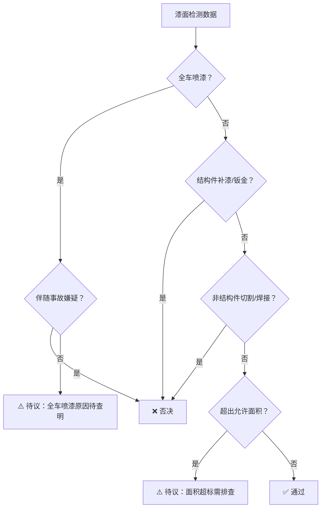
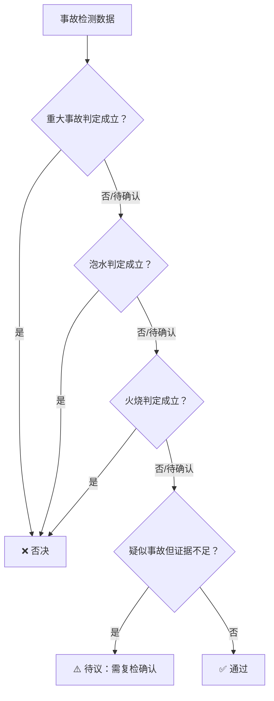
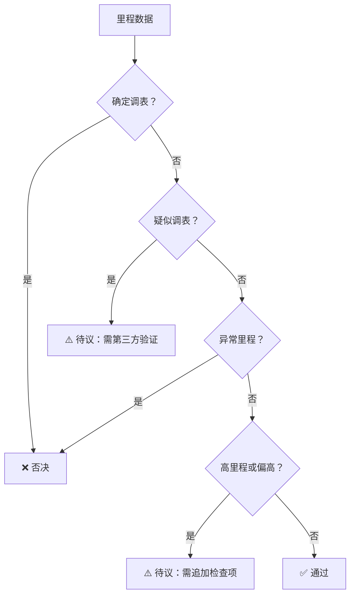
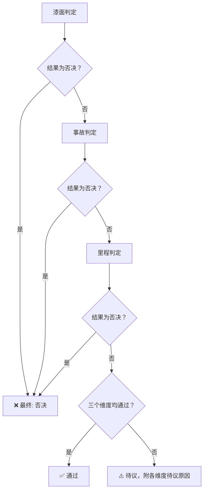

# 综合车况定义标准（三级判定：通过/待议/否决）

> **文档定位**：本文件是车辆车况评估的**顶层综合标准**，整合漆面状态、事故历史、里程三大维度，以三级判定（通过/待议/否决）为输出框架，统一指导二手车检测员、评估系统、输出报告的判定口径。
>
> **编制日期**：2026-05-16
> **版本**：v1.0

---

## 1. 三级判定体系概述

### 1.1 判定等级定义

| 等级 | 代号 | 含义 | 交易建议 |
|------|------|------|---------|
| **✅ 通过** | PASS | 车辆三大维度均符合可接受标准，无结构性风险，属于正常交易车辆 | 正常推荐，如实描述瑕疵 |
| **⚠️ 待议** | PENDING | 车辆在某些维度存在**非结构性疑虑**，需进一步验证或与买家充分沟通后再决定 | 需注明待议原因，建议第三方复检 |
| **❌ 否决** | REJECT | 车辆存在**结构性损伤、重大安全隐患或严重不实信息**，不建议交易 | 明确标识否决原因，建议放弃 |

### 1.2 三级判定的触发逻辑

```
输入车辆全维度检测数据（漆面 + 事故 + 里程）
│
├─ 任何维度触发「否决」→ 最终输出：❌ 否决
├─ 无否决，但任意维度触发「待议」→ 最终输出：⚠️ 待议（附待议原因）
└─ 三大维度均为「通过」→ 最终输出：✅ 通过
```

> **严控原则**：只要有一个维度进入否决，整体即为否决。否决优先于待议，待议优先于通过。

---

## 2. 漆面维度判定

### 2.1 判定标准概述

按 `paint_standard.md` 进行检测，最终映射至三级判定：

| 漆面状态 | 对应三级判定 | 典型场景 |
|---------|-------------|---------|
| 原版原漆（含可接受补漆，面积/部位/层数均在允许范围内） | **✅ 通过** | 全车原漆或仅小范围无钣金补漆 |
| 仅保险杠补漆（含全杠重喷） | **✅ 通过** | 保险杠属塑料易损覆盖件 |
| 非结构件补漆超出允许面积但不涉及钣金 | **⚠️ 待议** | 多个车门补漆（＞2个）、翼子板补漆面积略超限 |
| 全车喷漆（改色/翻新） | **⚠️ 待议** | 需要鉴别改色原因（事故修复 vs 个人喜好） |
| 结构件（A/B/C/D柱、纵梁、底板、前围板）有补漆或钣金 | **❌ 否决** | 结构件补漆提示重大碰撞修复 |
| 非结构件涉及切割/焊接 | **❌ 否决** | 车顶切割、后叶子板切割等 |
| 全车喷漆且伴有事故嫌疑（如纵梁修复、切割焊接） | **❌ 否决** | 以全车喷漆掩盖事故修复痕迹 |
| 车顶涉及任何钣金修复或切割 | **❌ 否决** | 车顶与侧围一体，钣金/切割即结构损伤 |

### 2.2 漆面维度判定流程



---

## 3. 事故维度判定

### 3.1 判定标准概述

按 `accident_standard.md` 检测，三大事故类型映射至三级判定：

| 事故类型 | 检测状态 | 对应三级判定 | 典型场景 |
|---------|---------|-------------|---------|
| 重大事故（结构损伤） | 未命中任何结构件损伤项 | **✅ 通过** | 车身结构完好 |
| 泡水 | 一级检出＜3项且二级检出＜2项 | **✅ 通过** | 仅轻微浮锈、无泥沙/异味 |
| 火烧 | 外观＜2项且机舱＜2项且驾驶舱＜1项 | **✅ 通过** | 无过火迹象 |
| 重大事故 | 结构件单项目损判定待确认（如仅某处焊点异常但无切割） | **⚠️ 待议** | 需第三方结构检测确认 |
| 泡水 | 一级检出3项但二级检出1项（差1项到满） | **⚠️ 待议** | 疑似泡水但证据不足，需复检 |
| 火烧 | 外观2项但机舱仅1项（差1项到满） | **⚠️ 待议** | 零星过火痕迹，需排除线路改装自燃 |
| 重大事故 | 命中任意一项结构件损伤（纵梁/A/B/C柱/底板/前围板/切割焊接） | **❌ 否决** | 结构件不可修复损伤 |
| 泡水 | 一级≥3项 + 二级≥2项 | **❌ 否决** | 泡水判定成立 |
| 火烧 | 外观≥2项 + 机舱≥2项 + 驾驶舱≥1项 | **❌ 否决** | 火烧判定成立 |
| 重大+泡水/火烧混合 | 任意两项组合判定成立 | **❌ 否决** | 同时被多类型事故事件影响 |

### 3.2 事故维度判定流程



---

## 4. 里程维度判定

### 4.1 判定标准概述

按 `mileage_standard.md` 检测，将年均里程等级映射至三级判定：

| 里程等级 | 对应三级判定 | 典型场景 |
|---------|-------------|---------|
| 低里程（＜0.8万km/年） | **✅ 通过** | 家用代步、短途通勤 |
| 正常里程（0.8~2.0万km/年） | **✅ 通过** | 家用车典型使用强度 |
| 偏高里程（2.0~3.5万km/年） | **⚠️ 待议** | 需追加高里程检查清单，向买家明示 |
| 高里程（3.5~5.0万km/年） | **⚠️ 待议** | 需执行完整高里程专项检查 |
| 异常里程（＞5.0万km/年） | **❌ 否决** | 疑似营运车辆或调表嫌疑 |
| 确定调表（维保记录里程＞显示里程） | **❌ 否决** | 里程不实，严重影响价值评估 |
| 疑似调表（内饰/机械磨损与里程差1~2档位） | **⚠️ 待议** | 需第三方验证里程真实性 |
| 低里程异常（年均＜0.3万km且车龄＞3年） | **⚠️ 待议** | 需检查橡胶件老化、长期静置损伤 |

> **品牌修正**：实际判定时需按品牌修正系数调整。如雷克萨斯（系数1.20）的年均正常上限为1.8×1.20=2.16万km，大于基准的2.0万km。

### 4.2 里程维度判定流程



---

## 5. 综合判定矩阵

### 5.1 三维聚合判定表

将漆面（P）、事故（A）、里程（M）三个维度的判定结果交叉组合，汇总为最终结论：

| 漆面判定 | 事故判定 | 里程判定 | 综合判定 | 输出说明 |
|---------|---------|---------|---------|---------|
| ✅ 通过 | ✅ 通过 | ✅ 通过 | **✅ 通过** | 三大维度均无异常，正常交易 |
| ✅ 通过 | ✅ 通过 | ⚠️ 待议 | **⚠️ 待议** | 仅里程需关注（偏高/高里程待查） |
| ✅ 通过 | ⚠️ 待议 | ✅ 通过 | **⚠️ 待议** | 事故方面存疑，需复检确认 |
| ⚠️ 待议 | ✅ 通过 | ✅ 通过 | **⚠️ 待议** | 漆面异常（全车喷漆/面积超标），需排除事故关联 |
| ⚠️ 待议 | ⚠️ 待议 | ✅ 通过 | **⚠️ 待议** | 漆面+事故均存疑，双重待议项叠加 |
| ⚠️ 待议 | ✅ 通过 | ⚠️ 待议 | **⚠️ 待议** | 漆面和里程异常需验证 |
| ✅ 通过 | ⚠️ 待议 | ⚠️ 待议 | **⚠️ 待议** | 事故和里程双重待议 |
| ⚠️ 待议 | ⚠️ 待议 | ⚠️ 待议 | **⚠️ 待议** | 三大维度均存疑，强烈建议第三方鉴定 |
| ❌ 否决 | — | — | **❌ 否决** | 任意维度否决 = 全盘否决 |
| — | ❌ 否决 | — | **❌ 否决** | 同上 |
| — | — | ❌ 否决 | **❌ 否决** | 同上 |

### 5.2 综合判定决策树



---

## 6. 输出格式规范

### 6.1 最终结论输出模板

```json
{
  "vehicle_info": {
    "brand": "品牌名称",
    "model": "车型名称",
    "year": 2020,
    "total_mileage_km": 60000,
    "registration_date": "2020-06-15"
  },
  "overall_verdict": "通过|待议|否决",
  "overall_verdict_label": "✅ 通过|⚠️ 待议|❌ 否决",
  "dimensions": {
    "paint": {
      "verdict": "通过|待议|否决",
      "summary": "原版原漆（可接受补漆）|全车喷漆|结构件补漆等",
      "details": "详细检测结果摘要"
    },
    "accident": {
      "verdict": "通过|待议|否决",
      "summary": "非事故车辆|疑似泡水（需复检）|重大事故车等",
      "details": "详细检测结果摘要"
    },
    "mileage": {
      "verdict": "通过|待议|否决",
      "summary": "正常里程|偏高里程|疑似调表等",
      "details": "实际年均里程 {{value}}万km/年，品牌修正系数 {{value}}，修正后正常上限 {{value}}万km"
    }
  },
  "pending_reasons": [
    "在待议状态下列出所有待议原因，逐条说明"
  ],
  "reject_reasons": [
    "在否决状态下列出所有否决原因，逐条说明"
  ],
  "recommendation": "交易建议描述文本",
  "inspection_required": [
    "需要进一步检查的具体项目列表"
  ]
}
```

### 6.2 自然语言输出示例

**示例1：通过案例**
```
✅ 综合判定：通过

• 漆面：原版原漆（可接受补漆，仅右前门一处≤30%面积补漆，无钣金）
• 事故：非事故车辆，结构件完好
• 里程：正常（3年6万km，年均2.0万km，品牌修正后正常范围内）

交易建议：正常推荐，如实描述右前门补漆记录。
```

**示例2：待议案例**
```
⚠️ 综合判定：待议

• 漆面：通过（原版原漆，无异常）
• 事故：待议（二级泡水检测差1项达标准，需第三方专业复检）
• 里程：通过（正常里程）

待议原因：泡水疑似项不完整，建议委托第三方进行泡水专项检测。
```

**示例3：否决案例**
```
❌ 综合判定：否决

• 漆面：否决（后叶子板涉及切割焊接，属结构件损伤）
• 事故：否决（命中重大事故标准：后叶子板切割+后围板变形）
• 里程：通过（正常里程）

否决原因：车辆后部结构件修复，确认重大事故车。
交易建议：不建议交易，存在结构性安全隐患。
```

---

## 7. 特殊情况裁定规则

### 7.1 边界模糊时的裁定原则

| 原则 | 说明 |
|------|------|
| **安全优先** | 涉及安全的疑虑一律向更严格方向裁定（待议→否决，通过→待议） |
| **证据导向** | 定性结论必须有≥2个独立检测项交叉验证，单项异常不足以判否决 |
| **记录优先** | 第三方权威报告（4S店记录、保险公司定损报告、第三方检测报告）优于经验判断 |
| **比例原则** | 轻微超限（如年均里程2.1万km vs 2.0万上限）以「待议」而非「否决」处理 |
| **逐层递进** | 先通过→如发现异常则待议→如确认重大风险则否决，不允许跳级 |

### 7.2 多类型事故叠加的裁定

| 组合 | 判定规则 |
|------|---------|
| 泡水+火烧 | 分别独立判定，任一项成立即否决；若两项均不成立但各有疑似，按**待议**处理 |
| 事故+泡水 | 两者独立判定。重大事故+泡水均成立→双重否决。只有一项成立→按照成立的否决 |
| 事故+漆面 | 结构件事故必然伴随该部位的漆面修复，此时以事故维度为**主判定**，漆面维度为辅助记录 |

### 7.3 争议复审机制

| 步骤 | 操作 | 负责方 |
|------|------|-------|
| 初判 | 按本标准做出三级判定 | 检测员/评估系统 |
| 异议 | 买方/卖方对判定结果有异议 | 任意一方 |
| 复检 | 委托第三方独立检测机构 | 争议双方协商 |
| 复审 | 第三方检测报告为准，修正初判结论 | 第三方检测机构 |
| 终裁 | 第三方报告与初判仍不一致时，以更严格的结论为准 | 安全原则 |

---

## 8. 各维度判定速查总表

| 条件 | 漆面 | 事故 | 里程 | 综合 |
|------|------|------|------|------|
| 全车原漆，无事故，里程正常 | ✅ | ✅ | ✅ | **✅ 通过** |
| 原漆+可接受补漆，无事故，里程正常 | ✅ | ✅ | ✅ | **✅ 通过** |
| 全车喷漆（非事故原因），无事故，里程正常 | ⚠️ | ✅ | ✅ | **⚠️ 待议** |
| 非结构件补漆超面积，无事故，里程正常 | ⚠️ | ✅ | ✅ | **⚠️ 待议** |
| 结构件补漆/钣金，事故成立 | ❌ | ❌ | ✅ | **❌ 否决** |
| 全车喷漆+结构件修复 | ❌ | ❌ | ✅ | **❌ 否决** |
| 原漆，泡水判定成立 | ✅ | ❌ | ✅ | **❌ 否决** |
| 原漆，火烧判定成立 | ✅ | ❌ | ✅ | **❌ 否决** |
| 原漆，无事故，异常里程（＞5万km/年） | ✅ | ✅ | ❌ | **❌ 否决** |
| 原漆，无事故，偏高里程（2~3.5万km/年） | ✅ | ✅ | ⚠️ | **⚠️ 待议** |
| 原漆，疑似泡水（差1项），偏高里程 | ✅ | ⚠️ | ⚠️ | **⚠️ 待议** |
| 结构件切割，泡水+火烧均不成立 | ❌ | ❌ | ✅ | **❌ 否决** |

---

## 9. 参考来源

- `paint_standard.md` — 原漆筛选标准（可接受补漆范围/面积/部位限制）
- `accident_standard.md` — 事故车筛选标准（重大事故/泡水/火烧）
- `mileage_standard.md` — 里程筛选标准（各品牌/车龄的年均里程阈值公式）
- GB/T 30323-2013《二手车鉴定评估技术规范》
- 中国汽车流通协会《二手车鉴定评估标准体系（行业指引）》

---

## 10. 附录：术语索引

| 术语 | 所属维度 | 简要定义 |
|------|---------|---------|
| 原版原漆 | 漆面 | 全车外露漆面均为出厂原漆 |
| 可接受补漆 | 漆面 | 非结构件、无钣金、面积在允许范围内的后补漆 |
| 全车喷漆 | 漆面 | 所有外露面板完全重新喷涂 |
| 结构件 | 事故/漆面 | A/B/C/D柱、纵梁、横梁、底板、前围板等车内承力结构 |
| 重大事故 | 事故 | 涉及结构件损伤、安全结构件触发或切割焊接的事故 |
| 泡水车 | 事故 | 车内进水超过座椅底部，导致电气/内饰受损的车辆 |
| 火烧车 | 事故 | 车辆过火导致外观/机舱/驾驶舱损毁的车辆 |
| 年均里程 | 里程 | 总里程÷车龄，衡量使用强度的核心指标 |
| 品牌修正系数 | 里程 | 不同品牌因可靠性/使用场景差异对里程阈值的修正倍率 |
| 车龄衰减系数 | 里程 | 随车龄增长年均里程呈下降趋势的修正因子 |
| 调表 | 里程 | 人为调整仪表显示里程数的行为 |

---

*文档版本: v1.0 / 编制日期: 2026-05-16*
*编制依据：paint_standard.md v1.0, accident_standard.md v1.0, mileage_standard.md v1.0*
